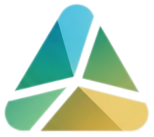
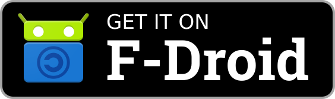

# Prism

 

Prism is a [UnifiedPush](https://unifiedpush.org/) distributor with support for a self-hosted [Prism](https://github.com/lone-cloud/prism) server.

Use it with any [UnifiedPush-compatible app](https://unifiedpush.org/users/apps/) to receive private, server-independent push notifications. Powered by [Mozilla Autopush](https://github.com/mozilla-services/autopush-rs) by default; transport URL is configurable in settings.

## Reproducible builds

Release APKs are [reproducible](https://f-droid.org/docs/Reproducible_Builds/). You can verify that the APK you download matches the source code by building it yourself and comparing the output.

## APK signature fingerprint

Use this SHA-256 signing certificate fingerprint to verify releases:

`FD:29:86:45:7A:6A:6E:4D:D9:05:6B:3C:A5:A6:9E:0E:DF:D5:AA:9D:D4:5B:3D:78:DB:21:E8:AD:72:FB:AE:AD`

## Screenshots

  
  
  

